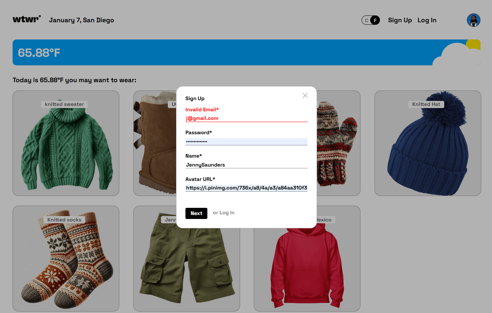
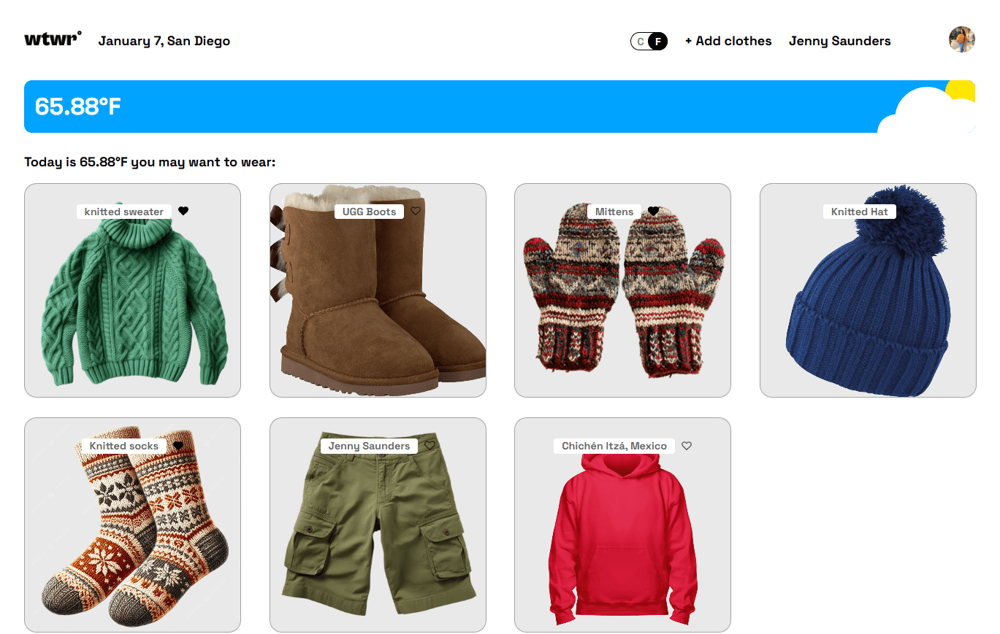
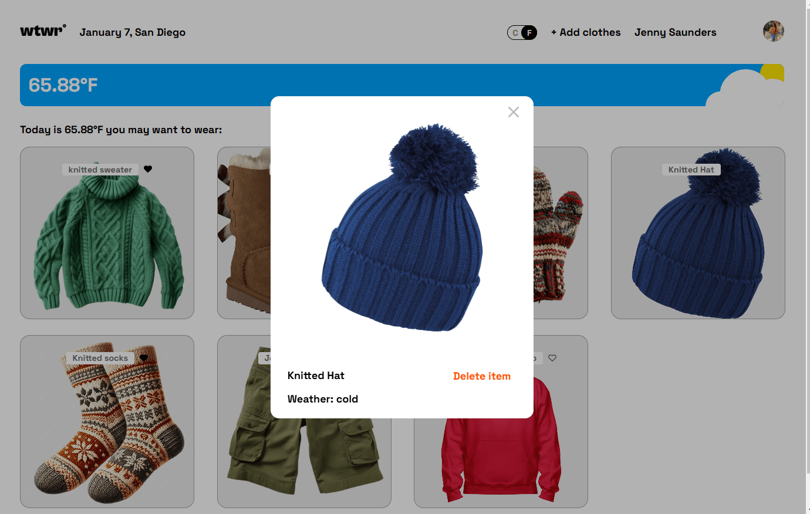
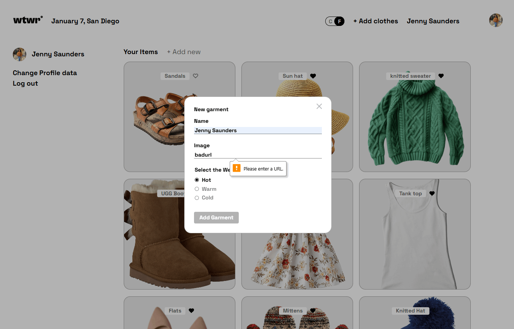

# **WTWR - What To Wear React App** 🧥🧳

This project is a front-end web application built with **React** that helps users decide what to wear based on the current weather. It fetches weather data via the **OpenWeather API**, and dynamically displays clothing recommendations based on the temperature. The app features a set of clothing cards, modals for item details, and filtering by weather conditions.

---







## **Key Features**

- **Dynamic Clothing Cards**: Clothing items are displayed as cards, each with an image and title, dynamically generated from a hard-coded data array.
- **Weather API Integration**: The app makes a call to the **OpenWeather API** to fetch current weather data, including location and temperature.
- **Location and Temperature Display**: The app displays the current location and temperature in the header.
- **Weather-based Filtering**: Clothing cards are filtered based on the current weather conditions, showing items suitable for hot, warm, or cold weather.
- **Modal Functionality**: Clicking on a clothing card opens a modal with more details about the item. A separate modal allows users to add new clothing items.
- **Adaptive Design**: The app is designed to be responsive across different screen sizes, using **CSS** best practices and adaptive design principles.

---

## **Core Components**

- **App.jsx**: The main wrapper for the app, responsible for managing state and rendering child components.
- **Header**: Displays the current location, date, and temperature. Includes an "Add Clothes" button that opens the modal for adding new clothing items.
- **Main**: Contains the weather card and the list of clothing items, filtered based on the weather data.
- **WeatherCard**: Displays the current temperature and weather conditions, received as props from the App component.
- **ItemCard**: Represents individual clothing items, which are clickable to open a modal with more details.
- **ModalWithForm**: A wrapper for the form used to add new clothing items, including validation and submission logic.
- **ItemModal**: Displays a detailed view of a selected clothing item.

---

## **Technologies Used**

- **React**: For building the component-based user interface.
- **OpenWeather API**: For fetching weather data such as current temperature and location.
- **CSS**: For styling and responsiveness.
- **Vite**: For fast development and bundling.

---

## **Project Setup**

### 1. Create a new Vite project:

Clone the repository and initialize a new **Vite** project:

```bash
cd se_project_react
npm create vite@5.3 .
npm install
npm run dev
```

**Link to Project Backend**
[**se_project_express**](https://github.com/JennyGlover/se_project_express)
